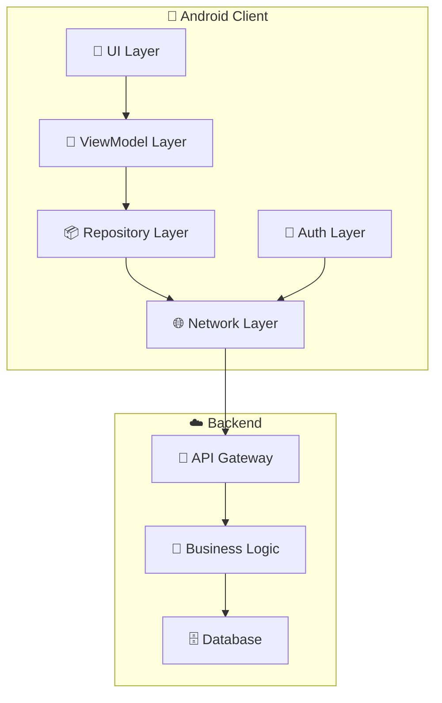

# 🚗 Parking App - Android Application

[](https://developer.android.com/)
[](https://kotlinlang.org/)
[](https://developer.android.com/jetpack/guide)
[](LICENSE)

> O aplicație Android modernă pentru gestionarea rezervărilor de locuri de parcare în timp real, construită cu arhitectură MVVM și tehnologii moderne.

## 📱 **Prezentare Generală**

Parking App este o soluție completă pentru gestionarea locurilor de parcare, oferind:

- 🗺️ **Hărți interactive** cu locuri de parcare în timp real
- 🔐 **Autentificare securizată** cu suport 2FA
- ⚡ **Actualizări în timp real** prin Server-Sent Events (SSE)
- 🚗 **Gestionarea vehiculelor** personalizată
- 📅 **Rezervări inteligente** cu notificări
- 🎨 **Interfață modernă** și intuitivă

## 🏗️ **Arhitectura Tehnică**

Aplicația folosește o arhitectură modernă bazată pe **MVVM (Model-View-ViewModel)** cu următoarele componente:



### **Tehnologii Folosite**

| Componentă | Tehnologie | Versiune |
|------------|------------|----------|
| **Language** | Kotlin | 1.9+ |
| **Architecture** | MVVM | - |
| **UI Framework** | Jetpack Compose + XML | - |
| **Networking** | Retrofit + OkHttp | 2.9+ |
| **Reactive Programming** | Kotlin Coroutines + Flow | 1.7+ |
| **Maps** | Google Maps API | - |
| **Authentication** | JWT + 2FA | - |
| **Real-time** | Server-Sent Events (SSE) | - |

## 🚀 **Instalare și Configurare**

### **Cerințe Preliminare**

- Android Studio Arctic Fox sau mai nou
- Android SDK API 24+ (Android 7.0)
- Google Maps API Key
- Backend server configurat

### **Pași de Instalare**

1. **Clonează repository-ul**
   ```bash
   git clone https://github.com/your-username/parking-app.git
   cd parking-app
   ```

2. **Configurează Google Maps API**
   - Obține un API key de la [Google Cloud Console](https://console.cloud.google.com/)
   - Adaugă cheia în `app/src/main/res/values/strings.xml`

3. **Configurează backend URL**
   - Editează `RetrofitClient.kt` cu URL-ul backend-ului tău

4. **Build și Run**
   ```bash
   ./gradlew build
   ./gradlew installDebug
   ```

## 📚 **Documentație**

### **📖 Ghiduri Rapide**

- [🏗️ Arhitectura High-Level](ARHITECTURA_HIGH_LEVEL.md) - Arhitectura detaliată cu exemple de cod
- [🎨 Design Patterns](DESIGN_PATTERNS_DOCUMENTATION.md) - Pattern-urile folosite în proiect
- [🔄 Fluxuri de Date](FLUX_ACTUALIZARI_TIMP_REAL.md) - Fluxurile de actualizare în timp real
- [🔐 Autentificare](FLUX_AUTENTIFICARE.md) - Sistemul de autentificare și 2FA

### **🔧 Ghiduri de Dezvoltare**

- [📱 UI Components](ui/README.md) - Componente UI și layout-uri
- [🧠 ViewModels](viewmodel/README.md) - Logica de business
- [📦 Repositories](repository/README.md) - Gestionarea datelor
- [🌐 Network Layer](network/README.md) - Comunicarea cu backend-ul

### **📊 Diagrame Arhitecturale**

- [🏗️ Arhitectura Generală](ARHITECTURA_HIGH_LEVEL.md#diagrama-arhitecturala)
- [🎨 UI Layer](diagrams/ui-layer.md)
- [🧠 ViewModel Layer](diagrams/viewmodel-layer.md)
- [📦 Data Layer](diagrams/data-layer.md)

## 🧪 **Testare**

### **Tipuri de Teste**

- **Unit Tests**: Pentru ViewModels și Repository
- **Integration Tests**: Pentru API calls
- **UI Tests**: Pentru fragmente și activități

### **Rularea Testelor**

```bash
# Toate testele
./gradlew test

# Teste unitare
./gradlew testDebugUnitTest

# Teste instrumentate
./gradlew connectedAndroidTest
```

## 🤝 **Contribuție**

Vă rugăm să citiți [CONTRIBUTING.md](CONTRIBUTING.md) pentru detalii despre procesul de contribuție.

### **Workflow de Dezvoltare**

1. Fork repository-ul
2. Creează un branch pentru feature (`git checkout -b feature/AmazingFeature`)
3. Commit schimbările (`git commit -m 'Add some AmazingFeature'`)
4. Push la branch (`git push origin feature/AmazingFeature`)
5. Deschide un Pull Request

## 📋 **Roadmap**

### **Versiunea 1.1** (În Dezvoltare)
- [ ] Notificări push
- [ ] Istoric rezervări
- [ ] Statistici utilizator
- [ ] Mod offline îmbunătățit

### **Versiunea 1.2** (Planificată)
- [ ] Plăți integrate
- [ ] Sistem de rating
- [ ] Chat support
- [ ] Integrare cu calendar

## 🐛 **Raportarea Bug-urilor**

Pentru a raporta bug-uri sau a solicita funcționalități noi:

1. Verifică dacă problema a fost deja raportată în [Issues](https://github.com/your-username/parking-app/issues)
2. Creează un nou issue cu template-ul corespunzător
3. Include informații detaliate despre problema întâlnită

## 📄 **Licență**

Acest proiect este licențiat sub [MIT License](LICENSE) - vezi fișierul pentru detalii.

## 👥 **Echipa**

- **Lead Developer**: [Numele tău](mailto:email@example.com)
- **UI/UX Designer**: [Numele designer-ului](mailto:designer@example.com)
- **Backend Developer**: [Numele backend developer-ului](mailto:backend@example.com)

## 🙏 **Mulțumiri**

- [Google Maps API](https://developers.google.com/maps) pentru serviciile de hărți
- [Jetpack Compose](https://developer.android.com/jetpack/compose) pentru UI modern
- [Retrofit](https://square.github.io/retrofit/) pentru networking
- [Kotlin Coroutines](https://kotlinlang.org/docs/coroutines-overview.html) pentru programare asincronă

---

<div align="center">

**⭐ Dacă ți-a plăcut acest proiect, dă-i un star! ⭐**

[](https://github.com/your-username/parking-app/stargazers)
[](https://github.com/your-username/parking-app/network/members)

</div>

# 📱 Aplicație Android Parcare - Instrucțiuni de Testare

Acest proiect reprezintă o aplicație Android pentru gestionarea locurilor de parcare, construită pe arhitectura MVVM, cu suport pentru autentificare, rezervări, actualizări în timp real și integrare cu Google Maps.

## 🛠️ Cerințe de Sistem

- **Android Studio**: Recomandat Arctic Fox (2020.3.1) sau mai nou
- **JDK**: Java 11 sau mai nou
- **Dispozitiv/Emulator**: Android 8.0 (API 26) sau mai nou
- **Conexiune la internet** (pentru funcționalități de backend și Google Maps)

## 📦 Importul Proiectului

1. **Deschide Android Studio**
2. Selectează `File > Open...` și alege folderul proiectului (ex: `test/`)
3. Așteaptă sincronizarea Gradle (poate dura câteva minute la prima deschidere)
4. Dacă este necesar, acceptă instalarea dependențelor lipsă (SDK-uri, plugin-uri)

## ⚙️ Configurare Inițială

- **Google Maps API Key**: Dacă aplicația folosește Google Maps, va trebui să adaugi cheia ta API în fișierul `local.properties` sau direct în `AndroidManifest.xml`:
  ```xml
  <meta-data
      android:name="com.google.android.geo.API_KEY"
      android:value="AICI_CHEIA_TA_API" />
  ```
- **Backend**: Asigură-te că backend-ul este pornit și accesibil la adresa specificată în `RetrofitClient` (implicit: `http://172.20.10.4:3000/`). Dacă folosești altă adresă, modifică `BASE_URL` în `RetrofitClient.kt`.
- **Permisiuni**: La prima rulare, acordă permisiunile cerute de aplicație (localizare, internet etc).

## ▶️ Rulare și Testare

1. **Selectează un emulator sau conectează un dispozitiv fizic**
2. Apasă `Run` (sau `Shift+F10`) în Android Studio
3. Aplicația va fi instalată și pornită automat
4. **Testează funcționalitățile principale:**
   - Autentificare și înregistrare
   - Vizualizare hartă și locuri de parcare
   - Rezervare loc parcare
   - Gestionare vehicule și profil
   - Actualizări în timp real (dacă backend-ul suportă SSE)

## 📝 Observații

- Pentru funcționalități complete, backend-ul trebuie să fie funcțional și să aibă date de test.
- Dacă întâmpini erori de rețea, verifică adresa IP/URL din `RetrofitClient` și conexiunea la internet.
- Pentru testare rapidă, poți folosi conturi de test sau poți crea utilizatori noi din aplicație.

## 📚 Documentație suplimentară

- [ARHITECTURA_HIGH_LEVEL.md](ARHITECTURA_HIGH_LEVEL.md) – descrierea arhitecturii și a fluxurilor principale
- [DESIGN_PATTERNS_DOCUMENTATION.md](DESIGN_PATTERNS_DOCUMENTATION.md) – documentația despre pattern-urile folosite

---

Dacă ai întrebări sau probleme la rulare, consultă documentația sau contactează dezvoltatorul. 