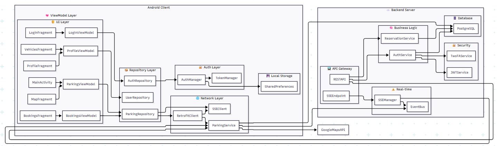
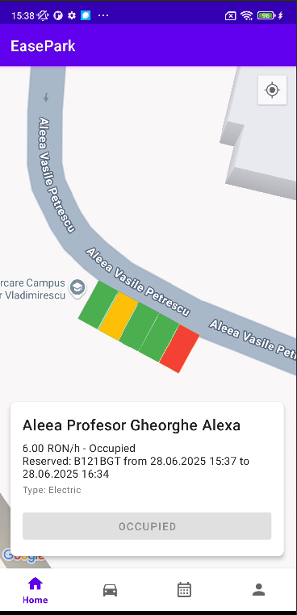
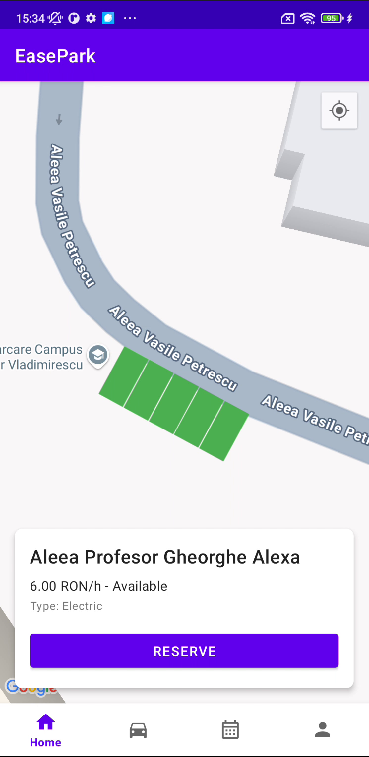
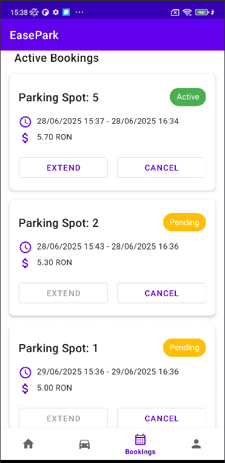
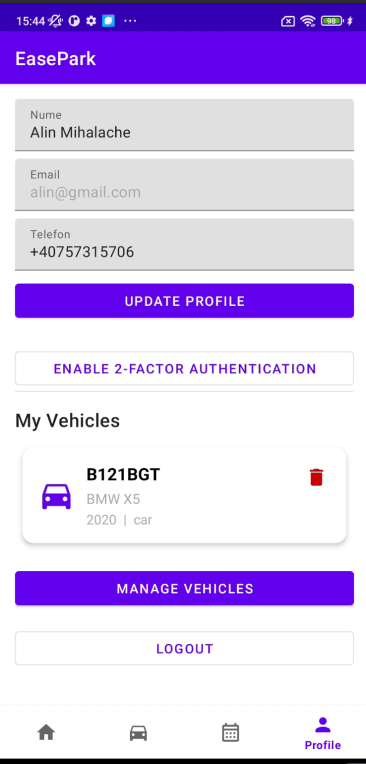
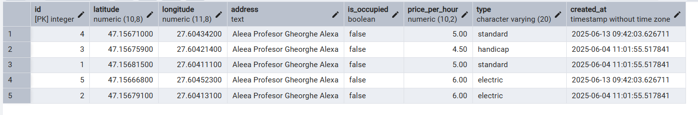
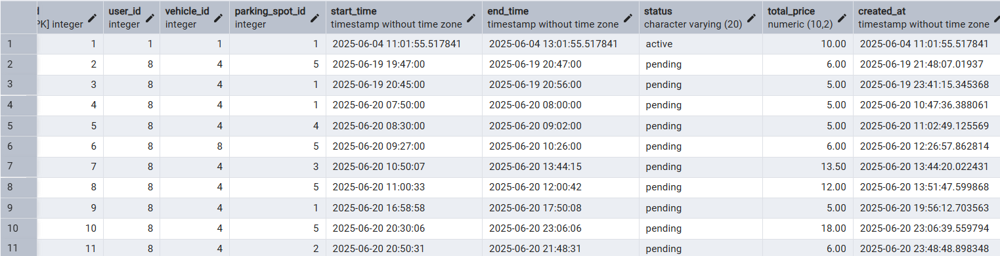

# 🚗 EasePark — Intelligent and Secure Parking Management System
### *(Bachelor’s Thesis Project — Full-Stack Application)*

This repository serves as an appendix for my Bachelor's Thesis project.  
It showcases the design and implementation of **EasePark**, an intelligent, secure, and real-time **parking management system** consisting of a **native Android app** and a **Node.js backend**.

---

## 🌟 Key Features

- 🗺️ **Real-Time Map** — View parking spots and their statuses (*Available, Pending, Active*) updated live.  
- 📅 **Reservation System** — Create, extend, and cancel reservations instantly.  
- ⚙️ **Automated Lifecycle** — Backend scheduler automatically transitions reservations through all stages.  
- 🔐 **Secure Authentication** — JWT-based login with bcrypt encryption and optional 2FA.  
- 📱 **Reactive Android Architecture** — Built on the MVVM pattern with a Single Source of Truth repository for consistent and responsive UI.

---

## 🏗️ System Overview

EasePark follows a **Client–Server architecture**, where the Android client communicates with the backend via a REST API and maintains a live connection using **Server-Sent Events (SSE)**.


### 🧩 Top-Level System Diagram


---

## 📸 Application Interface

### 🏠 Home Screen


### 🅿️ Parking & Bookings
| Map View | Booking Details |
|:--:|:--:|
|  |  |

### 👤 User Profile


---

## 🗃️ Database Visualization

These images illustrate how reservation data and parking spots are stored and managed in the PostgreSQL database.

| Reservations Table | Parking Table |
|:--:|:--:|
|  |  |

---

## 🎥 Demonstration Video

▶️ [Watch Full Demo on YouTube](https://youtube.com/shorts/VwXJlE5cITA)  
*(or view `assets/EasePark.mp4` locally)*

<details>
<summary>📽️ Click to see inline preview (if supported)</summary>

https://github.com/utilizatorulMeu/Design-and-implementation-of-an-intelligent-and-secure-system-for-parking-management-EasePark/assets/video_demo.mp4

</details>

---

## 🧠 Project Components

This repository is structured as a **monorepo** containing the two main system parts:

### ➡️ [Frontend (Android Application)](/Frontend/Licenta)
Built using **Kotlin**, **Google Maps SDK**, and modern **Jetpack** libraries (LiveData, ViewModel, Room).  
Implements MVVM architecture with a reactive UI.

### ➡️ [Backend (Node.js Server)](/Backend%20%2B%20DB/Backend_Licenta)
Developed using **Node.js**, **Express**, and **TypeScript**.  
Handles authentication, business logic, and real-time updates via **Server-Sent Events (SSE)**.  
Data persistence handled through **PostgreSQL**.

---

## ⚙️ Installation & Setup

### 🔹 Clone the Repository

```bash
git clone https://github.com/utilizatorulMeu/Design-and-implementation-of-an-intelligent-and-secure-system-for-parking-management-EasePark.git
```

## 🖥️ Backend Setup
```bash
cd backend-nodejs
npm install
npm run start
```

## 📱 Frontend Setup (Android)
Open the frontend-android folder in Android Studio,
then build and run the app on a physical or virtual device.

---

## 🧰 Technologies Used
| Category | Stack |
|-----------|--------|
| **Frontend** | Kotlin, Jetpack Compose, Google Maps SDK |
| **Backend** | Node.js, Express, TypeScript |
| **Database** | PostgreSQL |
| **Authentication** | JWT, bcrypt, 2FA |
| **Architecture** | MVVM, REST API, SSE |
| **DevOps** | GitHub, Docker (optional), CI/CD ready |
---

## 🎓 Thesis Context
Developed as part of my Bachelor’s Thesis at
Faculty of Electronics, Telecommunications, and Information Technology (TUIASI).

📄 The full written thesis is available upon request.

---

## 👤 Author
Alin-Gabriel Mihalache
🎓 Bachelor's Degree — Electronics, Telecommunications & IT, TUIASI
🔗 LinkedIn: [Alin-Gabriel Mihalache](https://www.linkedin.com/in/alin-gabriel-mihalache-67606b223/)
📧 alin.g.mhll@gmail.com

---

## 🪪 License
This project is open-sourced under the MIT License.
See the LICENSE file for details.